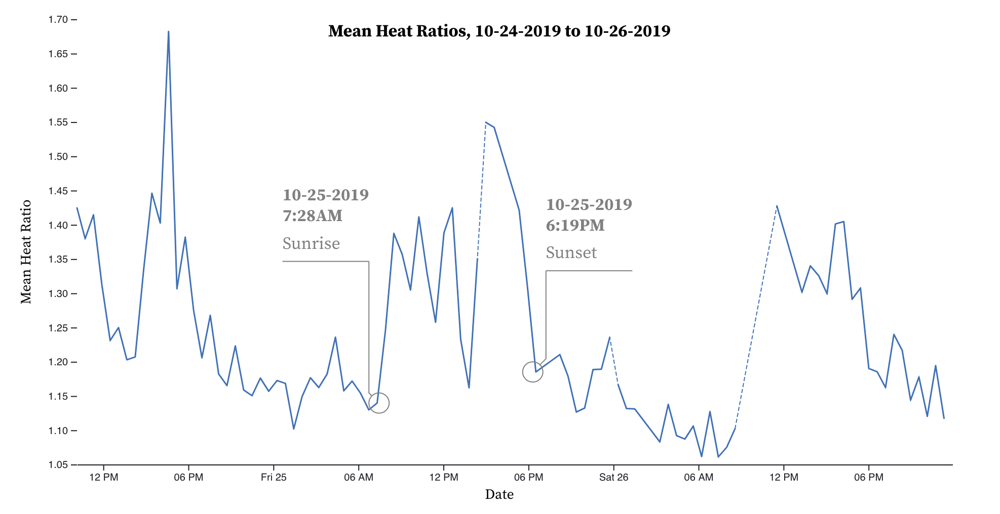

# Sapflow Using the External Heat Ratio Method

So you want to measure sapflow in plants? You and me both, buddy. The goal of this project is to create an open-source, accurate, robust, low-cost, and low-power system to help answer the age-old question: "How is my plant doing?"

Take a look at the [hardware](hardware) and [software](software) sections for instructions on what you'll need to set up your own system and join in on improving the project.